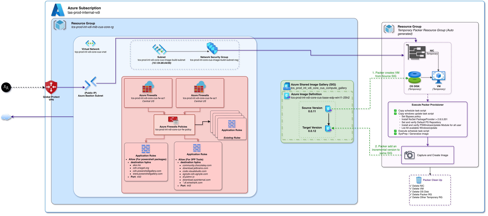

# VDI Golden Image Build — Packer Workflow

## Architecture


---

## Build Process

### Step 1 — Packer Creates a Temporary Resource Group

Packer uses the **Azure RM plugin** to orchestrate the build. It creates a temporary Resource Group to hold ephemeral
build resources:

- OS Disk
- NIC
- VM
- KeyVault

The temporary VM is attached to the **existing VNet, Subnet, and NSG** from the existing Resource Group. This provides
the build VM with internet connectivity and VM-to-VM communication through the already-established network
infrastructure.

### Step 2 — Temporary VM is Provisioned

Since the build uses the existing VNet, a **public IP is not required**. Connectivity to the internal build VM is
handled through the **Bastion subnet** with a valid VPN gateway — operators connect via Global Protect VPN.

The VM boots from a **source image version** in the Azure Shared Image Gallery (SIG) with Trusted Launch enabled (Secure
Boot + vTPM).

### Step 3 — Packer Connects via WinRM

Once the VM is running, Packer establishes a connection using the **WinRM communicator** over HTTPS. This is the channel
through which all provisioning commands are executed on the guest OS.

### Step 4 — File Provisioner Uploads Scripts

With the WinRM session active, Packer runs the **file provisioner** to upload two PowerShell scripts to the VM:

| Script                      | Purpose                                                                                                                            |
|-----------------------------|------------------------------------------------------------------------------------------------------------------------------------|
| `1.create-windows-task.ps1` | Creates a Windows Scheduled Task for running updates                                                                               |
| `2.windows-update-task.ps1` | The actual update task — installs NuGet package provider, PSWindowsUpdate module, lists and installs all available Windows Updates |

### Step 5 — PowerShell Provisioner Executes the Scheduled Task

Packer runs the **PowerShell provisioner** to execute the first script. This creates a Scheduled Task that:

- Runs as `SYSTEM` with highest privileges
- Triggers the Windows Update script after **2 minutes**
- Survives VM reboots by re-arming itself when a reboot is required

The Packer session **tails the log file** and monitors a state file until Windows Update reports completion.

### Step 6 — Sysprep Generalizes the OS

Once all Windows Updates are installed, Packer runs **Sysprep** to generalize the operating system:

```
Sysprep.exe /generalize /oobe /quit
```

This removes machine-specific state (SID, hostname, activation) so every VM deployed from the image receives a unique
identity.

### Step 7 — Snapshot and Publish to SIG

After Sysprep completes, Packer:

1. **Captures a snapshot** of the generalized OS disk
2. **Publishes a new image version** into the target Shared Image Gallery (SIG) definition
3. Optionally **stores the OS disk** based on the configuration parameter (`keep_os_disk`)

### Step 8 — Cleanup

Once the image version is successfully published, Packer **removes the temporary Resource Group**. This deletes all
resources that were created during the build:

- VM
- NIC
- OS Disk
- KeyVault
- The temporary Resource Group itself

Nothing is left behind after a successful build.

---

*Last updated: 2026-08-20 | Team: TAS*
